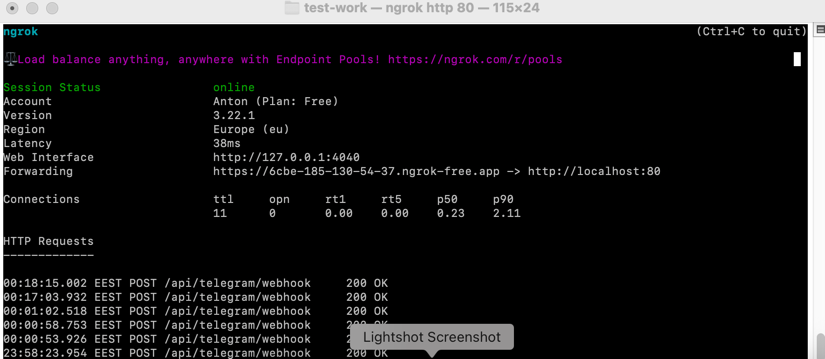

# docker up
```bash
docker-compose up -d
```
## docker in laravel.test container
```bash
cp .env.example .env
php artisan migrate
composer install
php artisan test
```
## custom functional commands
```bash
php artisan horizon
php artisan notify:tasks
```
## schedule work
```bash
php artisan schedule:work
```
## testing
```bash
php artisan test
```
## horizon queue dashboard
```
http://localhost/horizon/dashboard
```


## swagger documentation
```
http://localhost/api/documentation
```


# ngrok transform local address to https 
1. Install Ngrok
   Download it from: https://ngrok.com/download
   Then: Install and unzip it (follow OS-specific instructions on the site).

2. Sign up or log in to your Ngrok account.

3. Connect your auth token (copy it from your Ngrok dashboard):

```bash
ngrok config add-authtoken <YOUR_NGROK_TOKEN>
ngrok http 8000
```
you will receive: Forwarding https://f5d3-91-124-123-55.ngrok-free.app -> http://localhost:8000



# telegram bot webhook url address set
```bash
curl -X POST "https://api.telegram.org/bot7590073665:AAEBHlNd35382F8BvYshcoPaWC6n4bSSlxI/setWebhook" \
-d "url=<NGROK_URL>/api/telegram/webhook"
```

# telegram bot
```
@todousersbot
use commands:
/start
/stop
```

# example request body from tg
```aiignore
    {
        "update_id": 888829907,
        "message": {
            "message_id": 4,
            "from": {
                "id": 1111111111,
                "is_bot": false,
                "first_name": "Anton",
                "last_name": "Anton",
                "username": "anton_anton",
                "language_code": "uk"
            },
            "chat": {
                "id": 1111111111,
                "first_name": "Anton",
                "last_name": "Anton",
                "username": "anton_anton",
                "type": "private"
            },
            "date": 1747944307,
            "text": "/start",
            "entities": [
                {
                    "offset": 0,
                    "length": 6,
                    "type": "bot_command"
                }
            ]
        }
    }
```
# examples response body to tg
```aiignore
    {
        "status": true
    }
```
# after action with a user in the queue
```aiignore
    {
        "form_params":{"chat_id":1111111111,"text":"subscribed"}
    }
```

